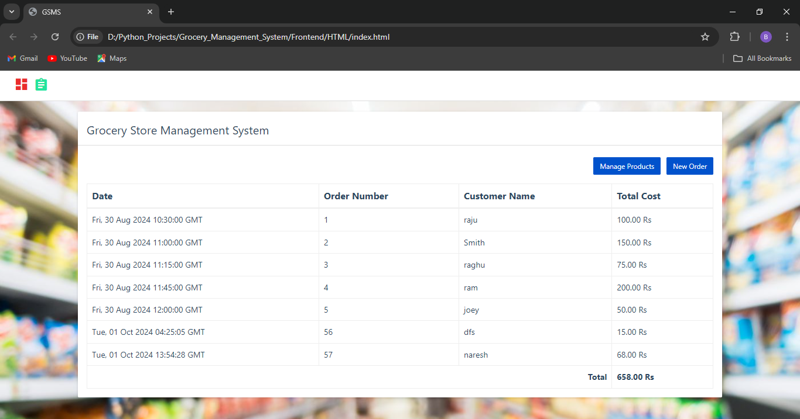

# Grocery_Store_Management_System
Created a 3 tier application for grocery store management.
1. Front end: UI is written in HTML/CSS/Javascript/Bootstrap
2. Backend: Python and Flask
3. Database: mysql

